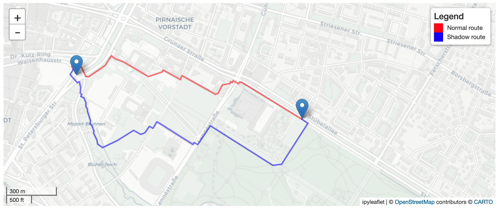

# Comparison between shortest and shadow routes

The notebook can be run via binder by clicking on [](https://mybinder.org/v2/gh/redfrexx/ors_routes_notebook/HEAD?labpath=Comparison_Shadow_Routes.ipynb)

Drag the icons on the map at the bottom of the notebook to recalculate the routes.

<p align=center>

</p>

## Installation

The required packages are listed in `requirements.txt`

After installing the packages run the following commands to enable the rendering of the map in the notebook.

```
jupyter contrib nbextension install --user
jupyter nbextension enable --py --sys-prefix ipyleaflet
```

## Usage

Run `jupyter notebook` and open the `Comparison_Shadow_Routes`. Drag the icons on the map at the bottom of the notebook to recalculate the routes.
